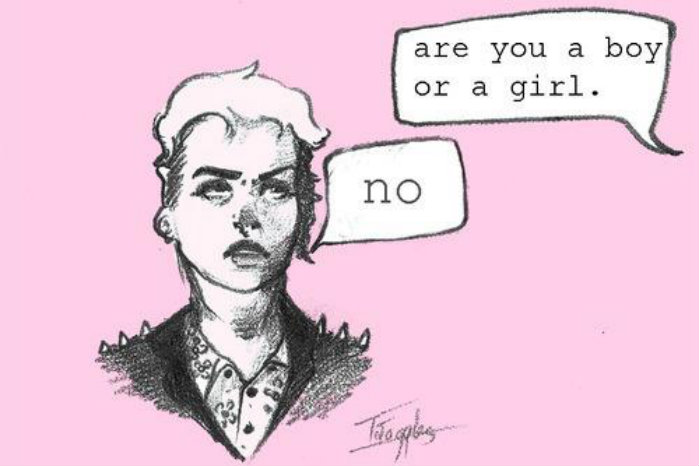

**Coding at Creating Change - Beginner Level**

## Project Set-Up

Create a new folder for your project.

We need a program to edit text. Download [Sublime](http://www.sublimetext.com/) and open it. There are many text editors available; this is just one that we like.

Create a new folder inside your folder and name it css.

[Bootstrap](http://getbootstrap.com/) is a framework that makes it easier to style your basic webpage. Go to the [Bootstrap website](http://getbootstrap.com/), click download, and then click download Bootstrap. Save it in your downloads folder.

Open the newly downloaded zip file. Open the dist folder, then the css folder. Then copy the bootstrap.css file into your css folder.

Open your project folder in Sublime by right clicking it and selecting open with. In Sublime, you should see your project folder and your css folder.

Using Sublime, create a new file in your project folder by right clicking on the project folder and selecting new file. Name it index.html

Do that again in Sublime to create a new file in your css folder called styles.css

## Setting up your index.html file

Now let's work on your index.html file. Open it in Sublime by clicking it in the sidebar.

First, we have to let your web browser know that this is an HTML file. HTML stands for Hyper Text Markup Language. Let's use an analogy of building a house. The HTML is the structure of the house - the wood, drywall, and the floorplans.

You're about to write your first bit of code! Write

```html
<!DOCTYPE html>
<html lang="en">
</html>
```

Your browser will know that everything between the 2nd and the 3rd line is written in HTML. The `lang="en"` bit tells the browser that the website will be in English, so that if it has built-in translation functionality, it knows what language the website is in. So we're going to write all the rest of our code within what we call the opening `<html>` tag and the closing `</html>` tag.

Now we need to let the browser know where to find supporting files that it will need to properly load the page. We call that section the head.

```html
<!DOCTYPE html>
<html lang="en">
  <head>
  </head>
</html>
```

We'll be adding those within the head. Note that the head tags are indented. We do that to keep the code organized and readable. That way, you can always see what section you're in, and make sure you've closed each section. It's kind of like outline format.

Now let's tell the browser about our supporting files. They're both stylesheets that will help us style this index.html file and can be found in the css folder within our project folder.

```html
<!DOCTYPE html>
<html lang="en">
  <head>
    <link rel="stylesheet" href="css/bootstrap.css">
    <link rel="stylesheet" href="css/styles.css">
  </head>
</html>
```

While we're working on the head, there's one more thing we can add: a title. This will show up on the tab in the browser.

```html
<!DOCTYPE html>
<html lang="en">
  <head>
    <title>Creating Change Website</title>
    <link rel="stylesheet" href="css/bootstrap.css">
    <link rel="stylesheet" href="css/styles.css">
  </head>
</html>
```

You can put anything you want in there, it doesn't have to be "Creating Change Website." Now let's create the body of the page. This is where everything we want to show up on the page will go. Let's throw in opening and closing body tags.

```html
<!DOCTYPE html>
<html lang="en">
  <head>
    <title>Creating Change Website</title>
      <link rel="stylesheet" href="css/bootstrap.css">
      <link rel="stylesheet" href="css/styles.css">
  </head>
  <body>
  </body>
</html>
```

## Let's see it!

If you opened this up in the browser right now, the page would be blank. Let's change that. Inside the body, let's add some text in a paragraph ('p') tag. Don't forget to indent! Note that this is just a snippet of the index.html file.

```html
<body>
  <p>I love social justice!</p>
</body>
```

Now open up your favorite browser. Click on 'open file' and navigate to your index.html file. You should see your sentence on the page!

## Adding styles

What if you wanted the text to look different? We can style it using our styles.css file. CSS stands for Cascading Style Sheet. Continuing the house analogy, CSS is like the paint on the house, the moldings, and the furniture. It's the interior and exterior decorating.

In Sublime, click on styles.css to open it. Then add the color red to anything in a p tag.

```css
p {
  color: red;
}
```

Make sure you've saved all of your files and then refresh in your browser to see your text in red.

## Classes and IDs

Let's throw in a little more text to the index.html file.

```html
<body>
  <p>I love social justice!</p>
  <p>I really love social justice</p>
  <p>I have the same class as sentence two</p>
</body>
```

Now save and refresh again.

What if you don't want all of your text - everything written in p tags - to be red?

We need a way to specify a tag in our CSS file. We do that with an ID, a unique identifier that we can refer to. An ID can only be used once in your HTML file. If you want to have an identifier that you can use multiple times in your HTML file, it's called a class.

```html
<body>
  <p id="sentence-1">I love social justice! </p>
  <p class="sentence-2">I really love social justice</p>
  <p class="sentence-2">I have the same class as sentence two</p>
</body>
```
Now we can update our styles.css file to specify that only things with the ID "sentence-1" should be red. Delete the "p" and replace it with `#sentence-1`. Because "sentence-1" is an ID, we use a hash.

```css
#sentence-1 {
  color: red;
}
```

Save and refresh and check it out!

Now let's add make the "sentence-2" class be underlined. Because it's a class, we use a period.

```css
#sentence-1 {
  color: red;
}

.sentence-2 {
  text-decoration: underline;
}
```

Save and refresh again. There are lots of styles that do lots of different things. So you can breathe easy now if you were worried that all you could do was make text red. Check out our resources list for CSS cheat sheets, or just do a little googling.

## Bootstrap

The folks at Bootstrap have written quite a bit of code for us. The bootstrap.css file that we downloaded and put in our css folder is just a really big CSS file. So if we use the classes that are styled in bootstrap.css in our index.html file, they'll get styled with Bootstrap.

In fact, Bootstrap's styles are already being applied because we included bootstrap.css in the head. Let's see what our page would look like without Bootstrap. To do that, we're going to disable the `<link rel="stylesheet" href="css/bootstrap.css"` line. We could just delete it and put it back in later, but then we'd lose the code. So instead we can temporarily disable it by commenting it out. Highlight that row and press `command+/` on your keyboard (`ctrl+/` on a PC). That disables the selected code from being read and processed by the browser.

Now save and refresh and see what happens!

In addition to making text look pretty, Bootstrap also can help make your page responsive to different sized screens, whether the page is viewed on a tiny smart phone or a giant monitor.

In order to use this functionality, we have to wrap our code in one of Bootstrap's "container" classes. The way to put our code in a class is to use a "div." The div is used to group elements of a page.

```html
<body>
  <div class="container">
    <p id="sentence-1">I love social justice! </p>
    <p class="sentence-2">I really love social justice</p>
    <p class="sentence-2">I have the same class as sentence two</p>
  </div>
</body>
```

Don't forget to un-comment the Bootstrap link from the head of index.html, so that the browser will be able to use bootstrap.css again.

## Adding images

Let's add an image to the page. First, create a folder in our project folder and call it "img".

Then, on the top of this page (by README.md), save image_1.jpg by right-clicking it and downloading it. Save it in your new img folder.

Now that we have the photo, let's get it on our page! Open up your index.html file and add an img tag, with the source (where to find the file) and an alternate (text that will appear if the image doesn't load or will be read aloud if the webpage viewer is visually impaired).

```html
<body>
  <div class="container">
    
    <p id="sentence-1">I love social justice! </p>
    <p class="sentence-2">I really love social justice</p>
    <p class="sentence-2">I have the same class as sentence two</p>
  </div>
</body>
```

Go check it out in the browser!

## The Grid System

What if we don't want everything to just get vertically stacked?

Bootstrap uses a [grid system](http://getbootstrap.com/examples/grid/) to help with layout. It's 12 units wide. Let's split the page into two columns of 6 units each.

```html
<body>
  <div class="container">
    <div class="col-md-6">
      
    </div>
    <div class="col-md-6">
      <p id="sentence-1">I love social justice! </p>
      <p class="sentence-2">I really love social justice</p>
      <p class="sentence-2">I have the same class as sentence two</p>
    </div>
  </div>
</body>
```

After you save and refresh, the image should be on the left and your 3 sentences on the right. (You may want to adjust the size of your browser window to see how Bootstrap stacks the columns when the browser window gets too skinny.)

## Adding more pictures

Bootstrap also has the option of creating rows of content. Let's further divide the page by splitting the left hand column into three rows. Add a few `"row"` classes with the content in between.

```html
<div class="col-md-6">
  <div class="row">
    
    
  </div>
  <div class="row">
    
    
  </div>
  <div class="row">
    
    
  </div>
</div>
```

Now after you save and refresh, there should be six copies of the image tiled in the left column.

## Adding more text

Let's add some more content to the right column. Below the existing text, let's add a headline. Instead of a regular "p" tag, we'll use an "h3" tag. "h" tags go from numbers 1 to 6, with 1 being the biggest headline and 6 being the smallest.

```html
<div class="col-md-6">
  <p id="sentence-1">I love social justice! </p>
  <p class="sentence-2">I really love social justice</p>
  <p class="sentence-2">I have the same class as sentence two</p>
  <div id="main-paragraph">
    <h3> I AM A FORMATTED PARAGRAPH TEXT</h3>
  </div>
</div>
```

A lot of developers and designers use filler text while building a site, when the real content isn't ready. It's called Lorem Ipsum. Today we'll have a little bit of fun and use [Hipster Ipsum](http://hipsum.co/) to generate 2 paragraphs of text.

Let's insert it below the h3 tag. We'll also give it an ID of "main-paragraph" in case we want to give it some specific styling later.

```html
<div class="col-md-6">
  <p id="sentence-1">I love social justice! </p>
  <p class="sentence-2">I really love social justice</p>
  <p class="sentence-2">I have the same class as sentence two</p>
  <div id="main-paragraph">
    <h3> I AM A FORMATTED PARAGRAPH TEXT</h3>
    <p>Cornhole messenger bag stumptown ennui mustache cred Blue Bottle +1. Truffaut four loko keffiyeh kitsch viral Marfa cliche, Echo Park chambray cornhole vinyl ethical cold-pressed kogi whatever. Artisan Neutra art party semiotics sartorial wayfarers, tattooed squid +1 meh mustache aesthetic Carles. Bitters listicle kale chips, meh four dollar toast chambray organic cred tattooed ethical. Craft beer Carles street art synth meh Schlitz deep v. Synth Neutra four loko chillwave VHS sartorial, small batch disrupt flannel selvage heirloom keffiyeh. Sartorial distillery readymade art party VHS drinking vinegar, taxidermy 8-bit dreamcatcher.</p>
    <p>Kitsch crucifix mustache distillery, health goth food truck irony master cleanse literally PBR lumbersexual hashtag umami tousled. Occupy retro trust fund squid Helvetica hoodie 8-bit shabby chic, brunch salvia biodiesel street art ugh. Paleo selvage cred twee, whatever pop-up readymade cardigan Pinterest authentic synth skateboard PBR cray. Brooklyn paleo beard, lo-fi roof party Tumblr lumbersexual butcher Godard umami. Direct trade before they sold out tofu, gluten-free authentic keffiyeh single-origin coffee beard roof party selvage VHS photo booth church-key. Next level forage four dollar toast, wolf before they sold out Odd Future 3 wolf moon tousled biodiesel vegan Bushwick Portland flexitarian Echo Park. Mumblecore heirloom pour-over, 3 wolf moon VHS deep v before they sold out pop-up post-ironic forage yr craft beer XOXO.</p>
  </div>
</div>
```

## Creating a Navigation Bar

Bootstrap also makes creating a [navigation bar](http://getbootstrap.com/examples/navbar/) easy. The navigation bar should exist on all of your site's pages and allows a user to navigate from one part of the site to another. Right now, we only have one page, but we'll build another one in a bit!

We're going to put the navigation bar at the top of the page. So it will be within the body and also within the "container", but outside of the columns.

```html
<body>
  <div class="container">
    <nav class="navbar navbar-default">
      <div class="container-fluid">
        <div class="navbar-header">
          <ul class="nav navbar-nav">
            <li class="active"><a href="index.html">Home</a></li>
            <li><a href="about.html">About</a></li>
            <li><a href="contact.html">Contact</a></li>
          </ul>
        </div>
      </div>
    </nav>
  </div>
...
```

Ok, so there's a bunch of new stuff in here. We're relying heavily on Bootstrap here, as you can see by all these classes we're using that we didn't define ourselves in styles.css. They all refer to styles defined in bootstrap.css.

There are a few new kinds of tags here. The "nav" tag holds a group of navigation links. The "ul" tag starts an "unordered list" (yes, there are also "ordered lists" that use an "ol" tag). Then within the unordered list are "li" tags, or "list item" tags. If you'd like to take a little side trip, now would be a good time to try out making lists in your right column of text. You could try turning one of your Hipster Ipsum paragraphs into a list instead.

The other new tag is the "a" tag. It defines a hyperlink to another page. The "href" part is the destination of the link. Whatever text is wrapped within the a tag is what will show up as a clickable link on the page.

Here, the first item in the unordered list contains a "Home" link that takes a user to index.html. That's the page we're currently working on, so if you click on it now, it will look like it's not doing anything.

The other two list items contain links to an About page and a Contact page. For those links to work, we'll have to create those two pages.

## Creating an About page

In your project folder, create a new file called about.html. Then copy everything from index.html into about.html. Then, remove the two columns and everything within them. You should be left with the head, body, container, and nav bar. If you want, you could change the title of the page to About as well.

Let's insert a big banner-style headline on the about page. In Bootstrap, this is called a [Jumbotron](http://getbootstrap.com/examples/jumbotron/).

After the code for the navigation bar, add the code for a jumbotron. Notice that it's an "h1" tag (the biggest headline) wrapped within a container, wrapped within a jumbotron class.

```html
<div class="jumbotron">
  <div class="container">
    <h1>My Social Justice Org</h1>
  </div>
</div>
```

You can also add a subheading if you want by adding in a p tag or two within the container.

```html
<div class="jumbotron">
  <div class="container">
    <h1>My Social Justice Org</h1>
    <p>Who we are</p>
  </div>
</div>
```

Finally, let's add some more Hipster Ipsum text as a stand in for a mission statement or a list of organization supporters.

```html
<body>
  <div class="container">
  ...
    <div class="jumbotron">
      <div class="container">
        <h1>My Social Justice Org</h1>
        <p>Who we are</p>
      </div>
    </div>
    <p>Vice health goth bespoke, Pitchfork American Apparel Austin fanny pack tote bag farm-to-table XOXO trust fund try-hard. Odd Future chambray XOXO VHS gluten-free slow-carb hoodie, McSweeney's listicle. Jean shorts brunch crucifix freegan. Four loko DIY ennui, listicle pork belly High Life Echo Park farm-to-table Tumblr Bushwick vinyl Thundercats. Gastropub hashtag swag, umami synth photo booth flannel Truffaut church-key salvia stumptown drinking vinegar. Umami cornhole Intelligentsia retro, High Life listicle Tumblr Marfa literally fashion axe Etsy. Chambray craft beer mustache jean shorts, Wes Anderson Carles photo booth narwhal cronut banh mi selvage.</p>
  </div>
</body>
```

Ok! Time to check it out in the browser. If you already have index.html open, try clicking the About link now and your About page should show up!


## Creating a Contact Page

In your project folder, create a new file called contact.html. We will be using the same navigation bar that we built on the previous page, so you can just copy and paste everything from `<!DOCTYPE html>` to the closing `</nav>` tag, then make sure to close everything up by adding

```html
    </div>
  </body>
</html>
```
to the end. This closes the container, body, and html tags. We will put our contact information inside the `<div class="container">` starting after the closing `</nav>`. As a header for the page, we will add an `<h1>` and give it an ID name of "contact-header".

```html
<h1 id="contact-header">Contact Us</h1>
```

In our styles.css we can declare that the header should be centered.

```
#contact-header {
  text-align: center;
}

```

Earlier on the home page we split the page into 2 columns.  Here instead of 2 colunms using 6 units each, we will have 3 columns using 4 units each.  So right after the contact-header we can make three empty columns.

```html
<div class="col-md-4">
</div>
<div class="col-md-4">
</div>
<div class="col-md-4">
</div>
```

Bootstrap comes with some useful [glyphicons](http://getbootstrap.com/components/#glyphicons) built in. Its nearly impossible to remember the class names for each one so it is common to have to visit the documentation page linked above for reference.

To get the glyphicons into your project, you should go back to the boostrap 'dist' folder from the beginning and move the entire fonts folder into your project. We will later reference the glyphicons inside this folder with class names.

On the contact page we will use the phone, envelope, and user glyphicons to represent email, phone number, and facebook link. Because we're relying on the glyphicons from Bootstrap, we need to be able to apply the appropriate glyphicon classes. But, what tag do we use? We don't necessarily want a p tag, or an a tag. And it's not a div, because it's not grouping a multiple lines of code. We use a span, which groups code within a line.

```html
<div class="col-md-4 contact-us">
  <span class="glyphicon glyphicon-phone-alt"></span>
</div>
<div class="col-md-4 contact-us">
  <span class="glyphicon glyphicon-envelope"></span>
</div>
<div class="col-md-4 contact-us">
  <span class="glyphicon glyphicon-user"></span>
</div>

```

Now when you refresh your contact page you should see the three glyphicons.

At this point when you refresh your contact page you should see the header "Contact Us" positioned in the center of the page, and also three lonely glyphicons evenly spaced.

Now lets add some information in each of the divs. This info is just something we made up, so feel free to add whatever information you like.


```html
<div class="col-md-4 contact-us">
  <span class="glyphicon glyphicon-phone-alt"></span>
  <p class="contact-info">708-432-5566</p>
</div>
<div class="col-md-4 contact-us">
  <span class="glyphicon glyphicon-envelope"></span>
  <p class="contact-info">awesome@creatingchange.com</p>
</div>
<div class="col-md-4 contact-us">
  <span class="glyphicon glyphicon-user"></span>
  <a href="https://www.facebook.com/CreatingChange"><p class="contact-info">facebook link</p></a>
</div>
```

Notice that we used an a tag again, but this time it's linking to an external website. Also notice that we created a new class called "contact-info" that we can then use in our CSS to style it. So now that we have all the important information on the page, let's clean it up and make it look a bit better.

## Styling the Contact Page
To put a bit of space between the contact header and the navigation bar we can increase the top margin.

```html
#contact-header {
  text-align: center;
  margin-top: 50px;
}
```

To create some space between the contact information and the header, we can follow the same convention.

```html
.contact-us {
  margin-top: 150px;
}
```

The glyphicons are kinda small, so if we want to make them a bit larger we can add this declaration to the styles.css. The browser thinks the glyphicon is a font, so when we resize it we will do it in the small manner as if it were text. Go ahead and try playing around with these numbers and see what happens! You should notice that "margin-bottom" puts space between the glyphicon and the information.

```html
.glyphicon {
  font-size: 40px;
  margin-bottom: 10px
}
```

Now we should center our contact information and the glyphs. This is a good time to learn about `display: inline` vs. `display: block`

Here is the most simple explanation of the two declarations.

`display: inline` = Takes up only as much width as it needs, and does not force new lines

`display: block` = Takes up the full width available, with a new line before and after

[more indepth explanation](http://webdesignfromscratch.com/html-css/css-block-and-inline/)


```html
.glyphicon {
  font-size: 40px;
  display: block;
  text-align: center;
  margin-bottom: 10px;
}
```

So in this css declaration, we are setting the glyphicon to `display: block`  so that it can take up the width of the column and then we `text-align: center` to center it within that column.

We can clean up the contact information by making it bold and centering the text.

```html
.contact-info {
  font-weight: bold;
  text-align: center;
}
```


Lastly, boostrap has a nice component called [wells](http://getbootstrap.com/components/#wells).  Wells are used on an element to give it an inset effect.

Add a new div inside each of your columns with the class name "well".

```html
<div class="col-md-4 contact-us">
  <div class="well">
    <span class="glyphicon glyphicon-envelope"></span>
    <p class="contact-info">awesome@creatingchange.com</p>
  </div>
</div>
```

Refresh, and you should be done with your simple three paged website.
